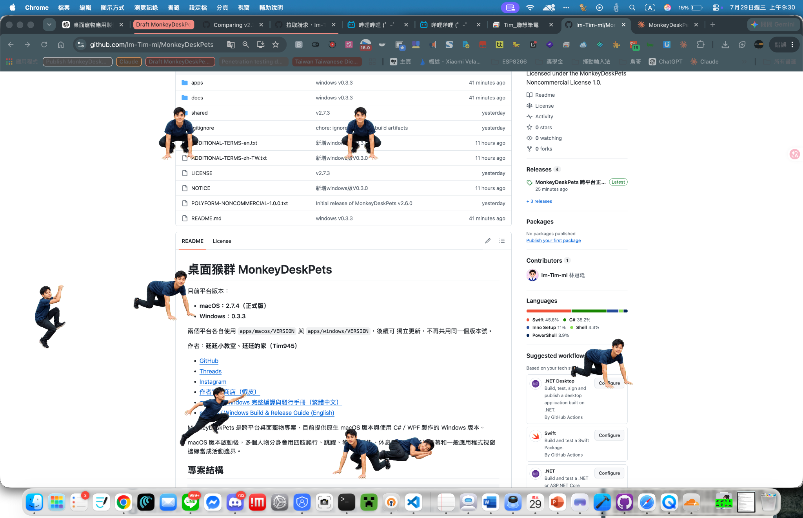
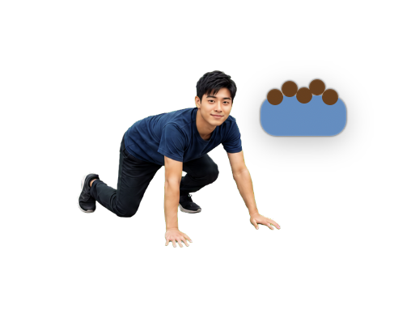
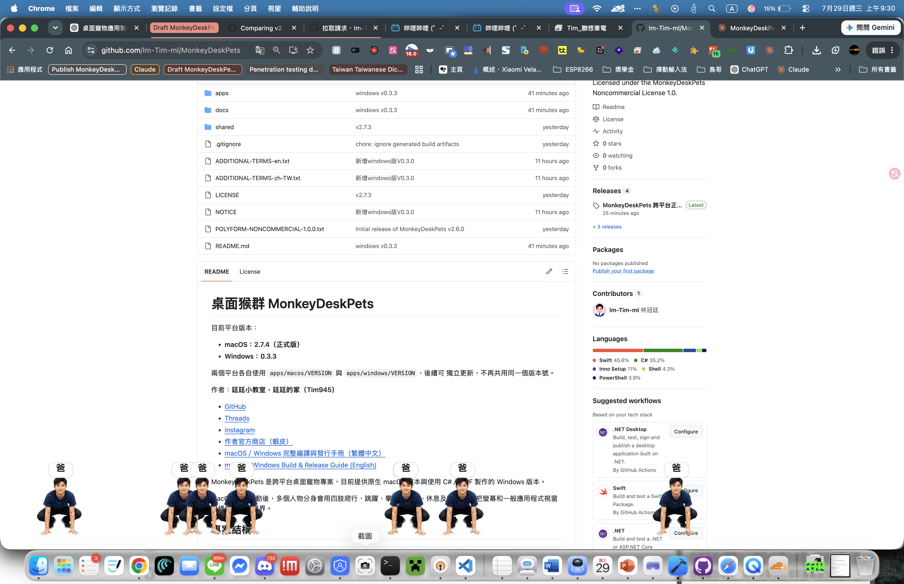
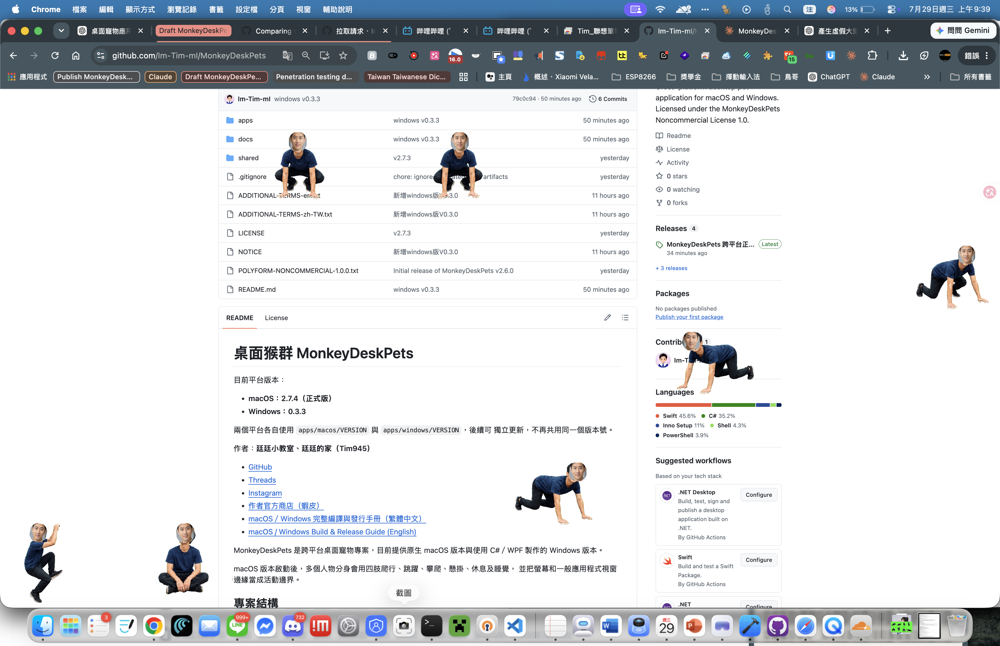
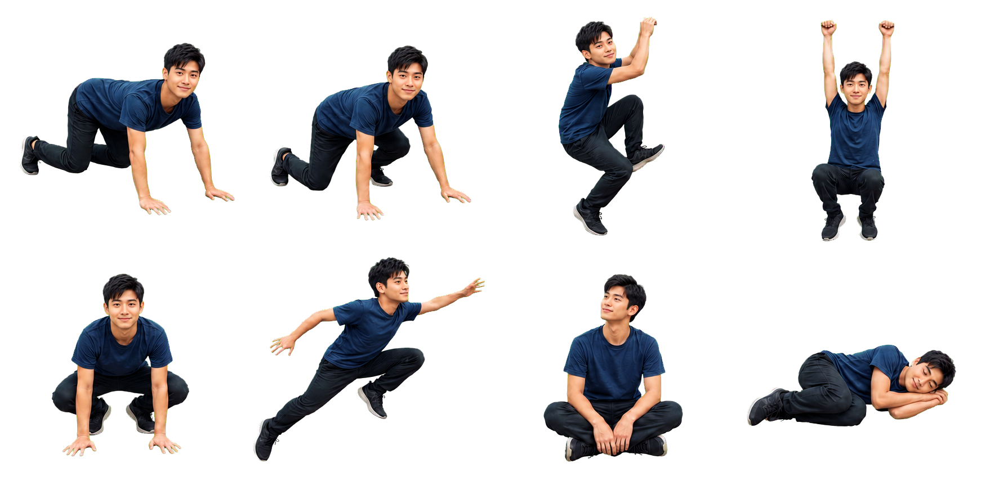
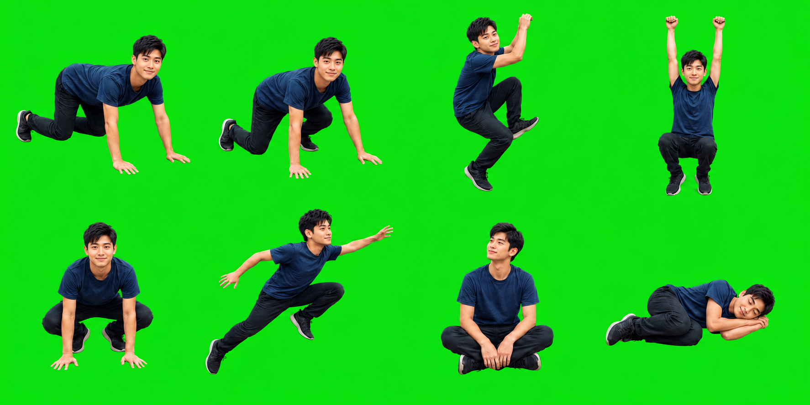

# 桌面猴群 MonkeyDeskPets

目前平台版本：

- **macOS：2.7.4（正式版）**
- **Windows：0.3.3**

兩個平台各自使用 `apps/macos/VERSION` 與 `apps/windows/VERSION`，後續可
獨立更新，不再共用同一個版本號。

作者：**廷廷小教室、廷廷的家（Tim945）**

- [GitHub](https://github.com/Im-Tim-mI)
- [Threads](https://www.threads.com/@tim945_1)
- [Instagram](https://www.instagram.com/tim945_1)
- [作者官方商店（蝦皮）](https://shopee.tw/rr901037)
- [macOS／Windows 完整編譯與發行手冊（繁體中文）](docs/BUILD-GUIDE-zh-TW.md)
- [macOS / Windows Build & Release Guide (English)](docs/BUILD-GUIDE-en.md)
- [使用 AI 製作 4×2 精靈圖（提示詞與範例）](docs/AI-SPRITE-GUIDE-zh-TW.md)
- [Create a 4×2 Sprite Sheet with AI (Prompt and Examples)](docs/AI-SPRITE-GUIDE-en.md)

MonkeyDeskPets 是跨平台桌面寵物專案，目前提供原生 macOS 版本與使用
C#／WPF 製作的 Windows 版本。

macOS 版本啟動後，多個人物分身會用四肢爬行、跳躍、攀爬、懸掛、休息及睡覺，
並把螢幕和一般應用程式視窗邊緣當成活動邊界。

## 功能預覽

| 全螢幕活動與視窗互動 | 餵食功能 |
|---|---|
| [](png/動物.png) | [](png/餵食.png) |
| **叫「爸」功能** | **懶人模式套用臉部** |
| [](png/爸.png) | [](png/懶人模式套用後樣子.png) |
| **精靈圖替換功能** | **精靈圖替換功能（綠幕版）** |
| [](png/精靈圖範例1.png) | [](png/精靈圖範例2.png) |

點擊圖片可查看原始尺寸。若想使用自己的角色，可直接上傳 4×2 精靈圖；
也可參考[使用 AI 製作 4×2 精靈圖](docs/AI-SPRITE-GUIDE-zh-TW.md)，把人物照片
交給支援圖片生成的 AI 製作素材。只想快速換臉時，則可使用程式內的「懶人模式」。

## 專案結構

```text
MonkeyDeskPets/
├── apps/
│   ├── macos/       # Swift／AppKit；版本位於 apps/macos/VERSION
│   └── windows/     # C#／WPF；版本位於 apps/windows/VERSION
├── shared/
│   └── assets/      # 跨平台共用精靈圖、作者圖片及廣告
├── LICENSE
└── NOTICE
```

## 功能

- 原生 Swift／AppKit，不需要 Electron
- 啟動時自動讀取 macOS 第一順位偏好語言；繁體中文與簡體中文語系均顯示
  繁體中文版，英文及其他所有語系預設顯示英文版
- 預設顯示 1 個人物，可從選單列逐一增加或減少
- 「減少一人」會先在被移除角色的位置播放卡通爆炸圖像；「只保留一人」
  會保留第一個角色，其餘角色同時爆炸退場
- 8 種人物姿勢與左右移動翻轉
- 可從選單選擇「餵食」，在任一螢幕點擊放置狗糧，並由最近且空閒的
  人物前往進食
- 螢幕邊緣碰撞，以及可見一般視窗頂緣碰撞
- 支援多桌面與全螢幕輔助層
- 可暫停、允許拖曳或切換為忽略滑鼠；拖曳期間固定顯示編號 3 懸掛姿勢，
  並暫停該人物的移動、重力、碰撞及其他動畫更新
- 拖曳具有 6 點移動門檻；普通點擊或輕微手部位移不會誤觸拖曳狀態
- 每幀執行螢幕可視範圍保護，避免人物因座標異常或多螢幕切換而消失
- 明確停用 `NSPanel` 的失焦隱藏與 App 隱藏行為；若面板可見性、透明度、
  圖片或座標異常，存活檢查會自動恢復
- 左右轉向使用啟動時預先產生的鏡像精靈，不再對顯示圖層套用負縮放，
  避免角色在右側反向、落地或睡眠切換時被移出視窗
- 選單可上傳 4×2 精靈圖，依左到右、上到下自動拆分為編號 0～7，
  保存於 Application Support 的 `Sprites/Current` 並立即套用；新素材完整
  驗證後才安全覆蓋舊素材，避免版本目錄持續占用空間
- App bundle 永久保留一組內建預設精靈；`Current` 缺檔、損壞或不存在時，
  啟動程序會自動回退預設圖片
- 內建預設角色採用重新設計的虛構亞洲男性面孔，不包含最初照片人物的
  臉部、眼鏡或可辨識身分特徵
- 上傳時分析圖片四周像素；若至少 60% 邊界樣本為高飽和綠色，自動進行
  柔邊透明化與綠色溢色抑制，再拆分 8 張圖片。非綠幕圖片不會套用去背
- 「懶人模式」只需選擇一張清楚臉部照片，程式使用 macOS Vision 在本機
  偵測最大臉部，套入內建角色的 8 個動作位置，生成透明 4×2 圖、拆分並
  立即套用；臉部照片不會上傳網路
- 僅在選單列顯示 `🐒`，不佔用 Dock
- App 與 DMG 掛載磁碟使用 MonkeyDeskPets 原創猴子圖示
- DMG 開啟後以繁體中文與英文提示將 MonkeyDeskPets 拖入 Applications，
  並以箭頭與自動排列的圖示引導安裝

## macOS 系統需求

- macOS 13 Ventura 或更新版本
- Xcode 15 或相容的 Swift 5.9 工具鏈
- Apple Silicon 與 Intel Mac 均可從原始碼建置

## 建置

```bash
git clone https://github.com/Im-Tim-mI/MonkeyDeskPets.git
cd MonkeyDeskPets
chmod +x apps/macos/scripts/*.sh
./apps/macos/scripts/build-app.sh
open apps/macos/dist/MonkeyDeskPets.app
```

建立含猴子磁碟圖示的 DMG 與 SHA-256：

```bash
chmod +x apps/macos/scripts/*.sh
./apps/macos/scripts/build-dmg.sh
open release
```

輸出為 `release/MonkeyDeskPets-macOS-v2.7.4.dmg` 與
`release/SHA256SUMS.txt`。

也可以直接開發執行：

```bash
cd apps/macos
./scripts/sync-shared-resources.sh
swift run
```

## Windows 建置

Windows 10 版本 1809 以上或 Windows 11 安裝 .NET 8 SDK 後，在 PowerShell：

```powershell
cd apps\windows
.\scripts\run-debug.ps1
```

建立 x64 自包含單檔發行 ZIP：

```powershell
.\scripts\build-release.ps1 -Runtime win-x64
```

安裝 Inno Setup 6 後可建立中英文安裝程式：

```powershell
.\scripts\build-installer.ps1 -Runtime win-x64
```

Windows 版已包含通知區選單、多人分身、拖曳、餵食、喊爸、爆炸退場、
4×2 精靈圖上傳、綠幕透明化、懶人模式臉部自動裁切與套圖、一般視窗
邊緣碰撞及完整關於／授權頁。Windows `0.3.3` 已以 macOS 版的 60 FPS
狀態機、11／17 秒行為週期、重力、餵食及喊爸流程重新規劃。臉部辨識與
精靈圖生成均在本機完成。

Windows 發行檔會依 `apps/windows/VERSION` 命名，例如：

```text
release\MonkeyDeskPets-Windows-win-x64-v0.3.3.zip
release\MonkeyDeskPets-Windows-win-x64-Setup-v0.3.3.exe
```

建議 GitHub Release 分別使用 `macos-v2.7.4` 與
`windows-v0.3.3` 標籤。

## macOS 權限

程式使用系統的螢幕視窗清單取得一般視窗的位置。若 macOS 詢問「螢幕錄製」權限，
允許後可得到較完整的視窗資訊；程式不會擷取、保存或上傳畫面內容。即使不授權，
人物仍可在螢幕範圍內活動。

首次開啟自行建置且未簽署的 `.app` 時，若 Gatekeeper 阻擋，可在 Finder 對應用程式
按右鍵選擇「打開」。正式散布時建議使用 Apple Developer ID 簽署及公證。

## 操作

點擊選單列的 `🐒`：

- 增加／減少人物
- 只保留一人：保留第一個角色，讓其他角色以爆炸圖像退場
- 關於 MonkeyDeskPets：顯示作者圖片、版本、作者，以及垂直排列且完整顯示
  網址的 GitHub、Threads、Instagram、作者蝦皮官方商店連結；羅技廣告圖片
  與圖片下方的完整商店網址皆可點擊，並可開啟完整
  「廣告與作者資訊保留條款」
- 餵食：選擇後在任一螢幕點擊放置狗糧，最近的角色會前往；進食時固定使用
  編號 1，朝狗糧方向前後往復約 2.4 秒
- 上傳精靈圖：選擇一張 4×2 圖片，自動拆解、保存並立即套用
- 懶人模式（上傳臉部）：選擇單張臉部照片，自動生成並套用 4×2 精靈圖
- 恢復預設精靈圖：確認後刪除 `Current` 與自訂素材，立即切換回 App bundle
  內建的虛構亞洲角色；取消確認則不變更任何檔案
- 開啟精靈圖目錄：在 Finder 查看 `Current` 中的原圖與
  `frame-0.png`～`frame-7.png`；綠幕素材另含 `processed-transparent.png`
- 按下「爸」後，所有人物會中止原動作，以編號 4 的猴式蹲伏快速降落到
  各自螢幕底部；等待全部人物抵達後，才會同時顯示「爸」對話框
- 暫停／繼續玩耍
- 切換是否忽略滑鼠
- 結束應用程式

## 素材與隱私

`person-sprites.png` 是依專案擁有者提供並授權使用的照片所衍生。請勿在未獲本人
同意的情況下，將人物素材用於冒充、騷擾或其他侵害肖像權的用途。

## 已知限制

- macOS 不提供桌面圖示的公開碰撞 API，因此目前把螢幕、Dock／選單列形成的可用
  區域，以及一般應用程式視窗邊緣視為障礙物。
- 跨螢幕且採不同排列方式時，部分視窗的座標轉換可能需要依實際配置微調。
- 動畫素材是單張姿勢表，屬於輕量原型；可再擴充為更多連續影格。

## 授權

本專案採 **MonkeyDeskPets Noncommercial License 1.0**，其基於
[PolyForm Noncommercial License 1.0.0](https://polyformproject.org/licenses/noncommercial/1.0.0)。
完整授權由 `LICENSE`、`POLYFORM-NONCOMMERCIAL-1.0.0.txt`、
`ADDITIONAL-TERMS-zh-TW.txt` 與 `NOTICE` 共同構成，禁止第三方商業使用，
並要求保留作者資訊、官方連結、「關於」頁面及隨附廣告功能。
`ADDITIONAL-TERMS-en.txt` 為英文翻譯，如有歧異以繁體中文條款為準。
